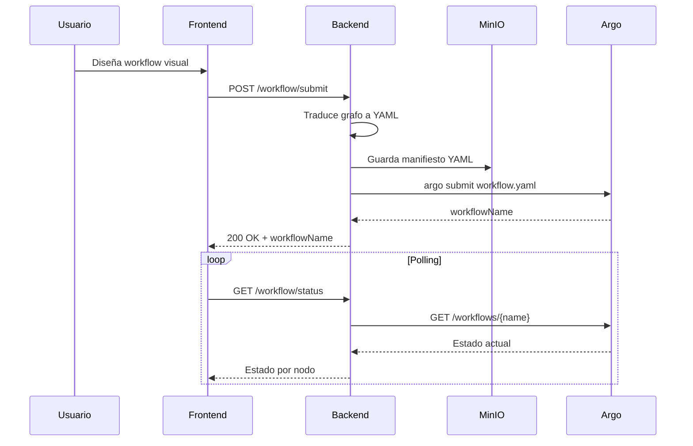

# 2.2 Diagrama de Contenedores (C4 Nivel 2)

## Introducción

El diagrama de contenedores amplía la vista de contexto, mostrando la estructura interna del sistema. En terminología C4, un "contenedor" es una unidad desplegable de forma independiente que ejecuta código o almacena datos (aplicación web, API, base de datos, etc.).

Este nivel de detalle permite entender cómo se distribuyen las responsabilidades entre los diferentes componentes del sistema.

---

## Diagrama

---

## Contenedores del Sistema

### Frontend SPA

| Atributo | Descripción |
|----------|-------------|
| **Tecnología** | Next.js 15, React 19, React Flow |
| **Tipo** | Single Page Application |
| **Responsabilidades** | Editor visual de workflows (drag-and-drop), monitorización de ejecución en tiempo real, visualización de logs |

El frontend proporciona la interfaz de usuario principal. Utiliza **React Flow** para el editor visual de grafos, permitiendo a los usuarios diseñar pipelines conectando nodos de manera intuitiva.

**Características principales:**
- Editor de flujos con arrastar y soltar
- Panel de configuración de parámetros por nodo
- Visualización del estado de ejecución en tiempo real
- Terminal integrada para logs
- Previsualización de artefactos de salida

---

### Backend API

| Atributo | Descripción |
|----------|-------------|
| **Tecnología** | FastAPI (Python) |
| **Tipo** | REST API |
| **Responsabilidades** | Gestión de workflows, traducción de grafos visuales a manifiestos Argo, gestión de artefactos, persistencia |

El backend es el núcleo de la lógica de negocio. Expone una API REST que el frontend consume para todas las operaciones.

**Módulos principales:**

| Módulo | Responsabilidad |
|--------|-----------------|
| `main.py` | Endpoints REST, gestión de uploads, consulta de estado |
| `workflow_builder.py` | Traduce grafos visuales a manifiestos YAML de Argo |
| `workflow_store.py` | Persistencia de definiciones de workflow en MinIO |
| `minio_helper.py` | Abstracción del cliente S3/MinIO |
| `argo_client.py` | Comunicación con Argo Server API |
| `catalog_loader.py` | Carga del catálogo de plantillas de nodos |

---

## Persistencia: MinIO como Almacenamiento Unificado

> [!NOTE]
> El sistema **no utiliza una base de datos tradicional**. Toda la persistencia se realiza mediante MinIO.

### Decisión de Diseño

En lugar de introducir una base de datos SQL/NoSQL, el sistema persiste las definiciones de workflow como ficheros JSON en MinIO. Esta decisión tiene implicaciones que conviene documentar:

**Ventajas:**
- Simplifica la arquitectura (un único sistema de almacenamiento)
- Facilita backups (todo es ficheros en S3)
- Los workflows ya tienen formato JSON natural
- MinIO ya es necesario para artefactos de Argo

**Desventajas:**
- Consultas limitadas (no hay índices, no hay queries SQL)
- El listado de workflows requiere escanear objetos
- No hay transacciones ACID entre múltiples objetos

**¿Por qué es aceptable?**
- El volumen esperado de workflows guardados es bajo (decenas, no millones)
- Las operaciones son simples (CRUD básico, sin joins complejos)
- Es un prototipo de laboratorio, no un sistema de producción a gran escala

---

## Comunicación entre Contenedores

| Origen | Destino | Protocolo | Descripción |
|--------|---------|-----------|-------------|
| Frontend | Backend | REST/JSON | Operaciones CRUD de workflows, consultas de estado |
| Backend | MinIO | S3 API | Almacenamiento de artefactos y definiciones JSON |
| Backend | Argo | CLI + REST | Submit de workflows (`argo submit`), consulta de estado y logs |

### Flujo de Ejecución de un Workflow

---

## Sistemas Externos

Los sistemas externos son los mismos documentados en el [Diagrama de Contexto](2.1-contexto.md):

- **MinIO / S3 Storage**: Almacenamiento de artefactos y workflows
- **Argo Workflows**: Orquestación de la ejecución
- **Kubernetes**: Runtime de contenedores
- **Container Registry**: Almacén de imágenes Docker

---

## Consideraciones de Escalabilidad

### Estado Actual (Prototipo)

La arquitectura actual está diseñada para un entorno de laboratorio con:
- Un único usuario o equipo pequeño
- Decenas de workflows, no miles
- Ejecución secuencial de experimentos

### Evolución Futura

Si el sistema requiriera escalar, se podrían considerar:

| Aspecto | Mejora Potencial |
|---------|------------------|
| Persistencia | Añadir PostgreSQL para metadatos con índices |
| Concurrencia | Múltiples réplicas del backend con balanceo |
| Eventos | Webhooks de Argo en lugar de polling |
| Cache | Redis para estado de workflows en ejecución |

Estas mejoras quedan fuera del alcance del prototipo actual, pero la arquitectura modular facilitaría su incorporación.
