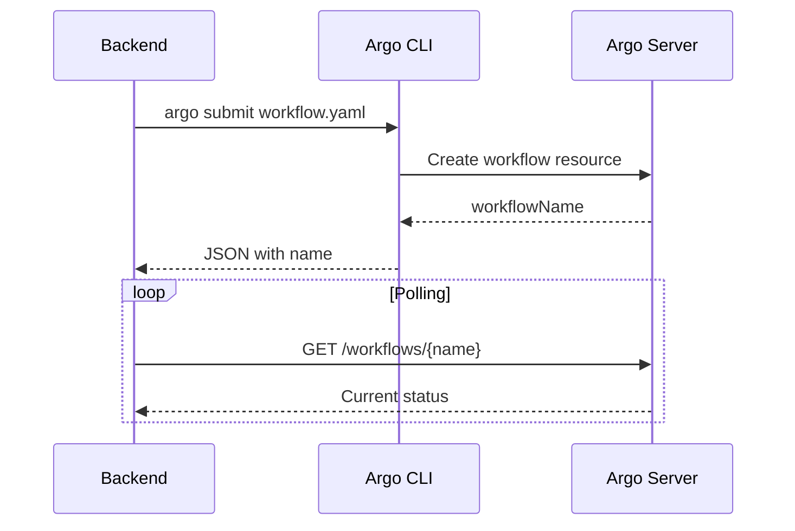

# 4.2. Comunicación entre Componentes

## Introducción

Este apartado describe los mecanismos de comunicación utilizados entre los diferentes componentes del sistema. Analiza tanto los protocolos de comunicación entre servicios de la plataforma como el patrón de paso de datos entre los contenedores de los workflows.

Es importante distinguir entre dos tipos de comunicación:

1. **Comunicación de la plataforma**: Cómo se comunican el frontend, backend, Argo y MinIO.
2. **Comunicación del workflow**: Cómo fluyen los datos entre los pasos de un workflow en ejecución.

---

## Tipos de Comunicación

La plataforma utiliza diferentes mecanismos de comunicación según el contexto:

| Tipo | Protocolo | Características | Uso en la Plataforma |
|:-----|:----------|:----------------|:---------------------|
| **Síncrona** | REST/HTTP | Request-response, bloquea hasta recibir respuesta | Frontend ↔ Backend |
| **Síncrona** | S3 API | Request-response sobre HTTP, operaciones de almacenamiento | Backend ↔ MinIO |
| **Síncrona** | gRPC | Alta eficiencia, tipado fuerte, streaming | Argo Server API (parcial) |
| **Pseudo-asíncrona** | CLI + Polling | Submit no espera finalización, polling para estado | Backend → Argo |
| **Artefactos** | S3 Objects | Datos como ficheros en almacenamiento compartido | Pods del workflow |

---

## Comunicación Síncrona: REST API

### Frontend → Backend

La comunicación entre el frontend y el backend es **exclusivamente REST sobre HTTP/JSON**. Esta elección se basa en:

- **Simplicidad**: JSON es legible y fácil de depurar.
- **Compatibilidad**: Funciona en cualquier navegador sin dependencias.
- **Herramientas**: Amplio ecosistema de testing (Postman, curl, etc.).

#### Flujo Típico

```
┌──────────┐          ┌──────────┐
│ Frontend │ ◄──────► │ Backend  │
│ (React)  │   REST   │ (FastAPI)│
└──────────┘   JSON   └──────────┘
```

#### Características Técnicas

| Aspecto | Configuración |
|:--------|:--------------|
| **Serialización** | JSON (application/json) |
| **Validación** | Pydantic en backend, TypeScript en frontend |
| **Errores** | HTTP status codes + body con detalle |
| **Autenticación** | No implementada en prototipo; Bearer JWT en objetivo |
| **CORS** | Permisivo en desarrollo; restrictivo en producción |

### Backend → MinIO

La comunicación con MinIO utiliza el **protocolo S3**, que es REST sobre HTTP con autenticación por firma:

```
┌──────────┐          ┌──────────┐
│ Backend  │ ◄──────► │  MinIO   │
│ (Python) │   S3 API │ (S3-compat)│
└──────────┘          └──────────┘
```

#### Operaciones Principales

| Operación | Método HTTP | Descripción |
|:----------|:------------|:------------|
| `put_object` | PUT | Sube un fichero |
| `get_object` | GET | Descarga un fichero |
| `stat_object` | HEAD | Obtiene metadatos sin descargar |
| `list_objects` | GET | Lista objetos con prefijo |
| `remove_object` | DELETE | Elimina un fichero |

#### Ejemplo de Uso

```python
from minio import Minio

client = Minio(
    endpoint="minio.default.svc:9000",
    access_key="minioadmin",
    secret_key="minioadmin",
    secure=False
)

# Subir artefacto
client.put_object(
    bucket_name="argo-artifacts",
    object_name="sessions/abc/input.csv",
    data=file_stream,
    length=-1,  # Unknown length, streaming
    content_type="text/csv"
)
```

---

## Comunicación con Argo Workflows

La integración con Argo utiliza **dos mecanismos complementarios**:

### 1. CLI para Submit

El envío de workflows se realiza mediante el CLI de Argo:

```bash
argo submit -n argo --output json workflow.yaml
```

**Ventajas del CLI:**
- Simplicidad de integración (subprocess)
- Manejo automático de autenticación del cluster
- Output estructurado disponible

**Desventajas:**
- Dependencia de binario instalado
- Overhead de crear proceso

### 2. REST API para Status/Logs

La consulta de estado y logs utiliza la API REST de Argo Server:

```
┌──────────┐          ┌──────────────┐
│ Backend  │ ◄──────► │ Argo Server  │
│          │   REST   │   (2746)     │
└──────────┘   JSON   └──────────────┘
```

#### Endpoints Utilizados

| Endpoint | Método | Descripción |
|:---------|:-------|:------------|
| `/api/v1/workflows/{namespace}/{name}` | GET | Estado del workflow |
| `/api/v1/workflows/{namespace}/{name}/log` | GET | Logs agregados |
| `/api/v1/workflows/{namespace}` | GET | Listar workflows |

### Flujo de Submit + Polling



---

## Comunicación de Workflow: Artifact Passing

Los contenedores que ejecutan los pasos del workflow **no se comunican directamente entre sí**. En su lugar, utilizan MinIO/S3 como intermediario para pasar datos.

### Diagrama de Flujo Completo


### Patrón Artifact Passing

Este patrón, detallado en el [apartado 2.3 de Patrones de Arquitectura](../2-alto-nivel/2.3-patrones-arquitectura.md), funciona de la siguiente manera:

1. **Paso N** escribe su salida en una ruta predefinida (ej: `/tmp/output/data.csv`)
2. Argo sube automáticamente ese fichero a S3 como artefacto de salida
3. **Paso N+1** declara ese artefacto como entrada
4. Argo descarga el artefacto y lo monta en la ruta esperada

#### Configuración en Argo

```yaml
# Template del paso que produce datos
- name: preprocessing
  container:
    image: preprocessing:v2
  outputs:
    artifacts:
    - name: processed-data
      path: /tmp/output/processed.csv
      s3:
        key: sessions/{{workflow.name}}/preprocessing/output.csv

# Template del paso que consume datos
- name: training
  container:
    image: training:v2
  inputs:
    artifacts:
    - name: processed-data
      path: /tmp/input/processed.csv
      # from: se define en el DAG, no aquí
```

### Ventajas de Este Patrón

| Ventaja | Descripción |
|:--------|:------------|
| **Desacoplamiento total** | Los contenedores no necesitan saber quién produce los datos |
| **Tolerancia a fallos** | Si un paso falla, los intermedios persisten |
| **Reproducibilidad** | Se puede re-ejecutar cualquier paso con los mismos inputs |
| **Trazabilidad** | Todos los artefactos quedan almacenados |
| **Independencia de red** | No hay comunicación directa entre pods |

### Desventajas y Consideraciones

| Desventaja | Mitigación |
|:-----------|:-----------|
| **Latencia I/O** | Aceptable para batch; no apta para streaming |
| **Almacenamiento temporal** | Políticas de retención para limpiar artefactos |
| **Tamaño de artefactos** | Límites configurables, compresión opcional |

---

## Alternativas No Utilizadas

### Colas de Mensajes (RabbitMQ, Kafka)

Las colas de mensajes son apropiadas para:
- Comunicación asíncrona entre servicios permanentes
- Eventos que deben procesarse en orden
- Desacoplamiento temporal (productor/consumidor no sincrónicos)

**¿Por qué no se usan?**

Los contenedores del workflow son efímeros, no servicios permanentes. No hay un "consumidor" esperando mensajes; hay un orquestador (Argo) que decide cuándo crear cada contenedor. El patrón de artifact passing cubre la necesidad de paso de datos sin añadir infraestructura adicional.

### gRPC Directo

gRPC es apropiado para:
- Comunicación de alta frecuencia entre servicios
- Streaming bidireccional
- Contratos fuertemente tipados

**¿Por qué no se usa?**

- El frontend está en navegador (gRPC-web tiene limitaciones)
- La frecuencia de llamadas no justifica la complejidad
- JSON es suficiente para los volúmenes actuales

### Service Mesh (Istio, Linkerd)

Un service mesh es apropiado para:
- Microservicios con alta interdependencia
- Observabilidad avanzada
- Políticas de seguridad granulares

**¿Por qué no se usa?**

En el prototipo hay un único servicio backend. Cuando se evolucione a microservicios, un service mesh podría añadir valor, pero introduciría complejidad operativa significativa.

---

## Arquitectura Objetivo: Comunicación entre Servicios

En la arquitectura objetivo con múltiples servicios, la comunicación evolucionará:

### Comunicación Síncrona Interna

```
┌────────────┐     ┌────────────┐     ┌────────────┐
│ API        │────►│ Workflow   │────►│ Execution  │
│ Gateway    │     │ Service    │     │ Service    │
└────────────┘     └────────────┘     └────────────┘
       │                  │                  │
       │                  │                  │
       ▼                  ▼                  ▼
┌────────────┐     ┌────────────┐     ┌────────────┐
│ Auth       │     │ Catalog    │     │ Argo       │
│ Service    │     │ Service    │     │            │
└────────────┘     └────────────┘     └────────────┘
```

- **Protocolo interno**: REST o gRPC según requisitos de rendimiento
- **Service discovery**: DNS de Kubernetes (servicename.namespace.svc)
- **Load balancing**: Kubernetes Services con ClusterIP

### Comunicación Asíncrona (Futura)

Para ciertos casos, podría introducirse comunicación asíncrona:

| Caso de Uso | Mecanismo |
|:------------|:----------|
| Notificaciones de workflow completado | Webhooks o Cola |
| Eventos de auditoría | Cola persistente (Kafka) |
| Alertas | Pub/Sub |

Esto queda fuera del alcance del prototipo actual.

---

## Resumen de Protocolos

| Comunicación | Protocolo | Sincronía | Prototipo | Objetivo |
|:-------------|:----------|:----------|:----------|:---------|
| Frontend ↔ Backend | REST/JSON | Síncrona | ✅ | ✅ |
| Backend ↔ MinIO | S3 API | Síncrona | ✅ | ✅ |
| Backend → Argo Submit | CLI | Síncrona | ✅ | ¿REST? |
| Backend ↔ Argo Status | REST | Síncrona | ✅ | ✅ |
| Pasos del Workflow | S3 Artifacts | Indirecta | ✅ | ✅ |
| Servicios Internos | REST/gRPC | Síncrona | N/A | ✅ |
| Eventos/Notificaciones | Webhooks/Cola | Asíncrona | ❌ | ✅ |
| API Gateway ↔ Auth | REST/gRPC | Síncrona | N/A | ✅ |
