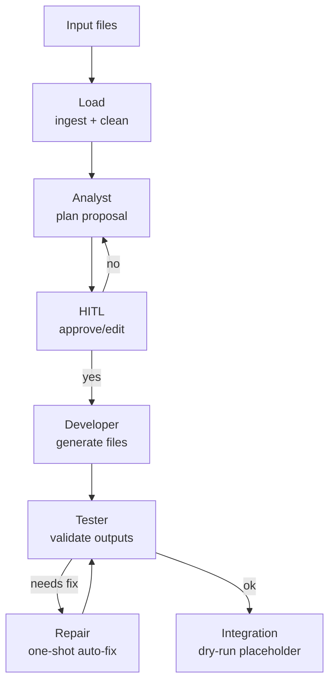

# Component Generation (CLI + API)

This module provides a pipeline for generating component stubs from source
files. It can run from CLI and is also exposed through backend API endpoints
consumed by the Next.js UI route `/component-generation`.

---

## Pipeline graph (LangGraph)



---

## Current scope

- LangGraph pipeline with Analyst -> HITL -> Developer -> Tester -> Repair.
- Execution via CLI and via API (`/component-generation/runs` + SSE events).
- UI flow in frontend (`/component-generation`) with plan approval, live graph,
  timeline events, and hard cancel.
- Integration step is a dry-run placeholder (unless `--run-integration`).
  - Session scripts are generated to build images and register components.

---

## Module layout

```text
backend/component_generation/
  cli.py                 # CLI entrypoint (offline runner)
  context.py             # repo context snippets (docs/specs)
  ingest.py              # file + notebook ingest
  llm.py                 # LLM clients (Ollama/OpenRouter)
  llm_trace.py           # writes LLM request/response per node + session
  logging_utils.py       # log setup (json/plain)
  schemas.py             # Pydantic schema for plans/reports
  state.py               # LangGraph pipeline state
  workflow.py            # LangGraph graph definition
  prompts/
    analyst_system.md
    analyst_context.md
    developer_system.md
    developer_context.md
    repair_system.md
    repair_context.md
  nodes/
    loader.py            # ingest + save combined_source
    analyst.py           # heuristic plan
    hitl.py              # human approval loop
    developer.py         # stub component files
    tester.py            # basic validations
    repair.py            # one-shot auto-fix from reviewer issues
    integration.py       # dry-run placeholder
```

---

## What each file does

### Top-level module files

- `backend/component_generation/cli.py`
  - CLI entrypoint for running the pipeline locally.
  - Handles flags (`--inputs`, `--auto-approve`, `--log-level`, etc.).
  - Writes session outputs to `components/generated-sessions/<id>/`.

- `backend/component_generation/workflow.py`
  - Defines the LangGraph graph and the node ordering.
  - Contains the conditional edge for HITL (approve vs. revise).

- `backend/component_generation/state.py`
  - Defines the shared pipeline state shape (`PipelineState`).
  - Central place to understand what each node reads/writes.

- `backend/component_generation/schemas.py`
  - Pydantic models used by the plan and review stages.
  - Intended to stay stable as the API gets introduced.

- `backend/component_generation/ingest.py`
  - Reads any text file.
  - Special handling for `.ipynb`:
    - Only Python notebooks are accepted.
    - Outputs are stripped; only code is kept.
    - Optional markdown can be included as comments.

- `backend/component_generation/context.py`
  - Loads the prompt context files from `backend/component_generation/prompts/`.

- `backend/component_generation/logging_utils.py`
  - Logging setup and JSON formatter.
  - Used by the CLI to provide consistent observability.

### Node implementations (LangGraph)

- `backend/component_generation/nodes/loader.py`
  - Ingests files and writes `combined_source.txt` for traceability.

- `backend/component_generation/nodes/analyst.py`
  - Calls LLM to generate a plan (`ExtractionPlan`).
  - Validates IO paths (inputs under `/data/inputs`, outputs under `/data/outputs`,
    config only under `/data/config` with role `config`).
  - Produces `plan.json` for review and HITL.

- `backend/component_generation/nodes/hitl.py`
  - Interactive approval loop in the terminal.
  - If not TTY or `--auto-approve`, skips prompts.

- `backend/component_generation/nodes/developer.py`
  - Calls LLM to generate `main.py`, `Dockerfile`, `ComponentSpec.json`.
  - Strictly validates `ComponentSpec` before writing to disk.

- `backend/component_generation/nodes/tester.py`
  - Validates generated outputs:
    - ComponentSpec schema (from `backend/component_spec.py`)
    - IO paths under `/data/inputs|outputs|config`
    - Dockerfile + argparse sanity checks

- `backend/component_generation/nodes/repair.py`
  - One-shot auto-fix based on tester issues.
  - Re-validates ComponentSpec after repair.

- `backend/component_generation/nodes/integration.py`
  - Placeholder. Logs that integration is skipped unless `--run-integration`.

## CLI usage

Install backend deps:

```bash
uv sync --project backend
```

Run with any file(s):

```bash
uv run --project backend python -m component_generation.cli \
  --inputs path/to/script.py path/to/notebook.ipynb \
  --auto-approve \
  --log-level INFO
```

Notebook handling:
- Only Python notebooks (`.ipynb`) are accepted.
- Outputs are stripped (only code is kept).
- Optional markdown can be included as comments:

```bash
uv run --project backend python -m component_generation.cli \
  --inputs path/to/notebook.ipynb \
  --include-markdown \
  --auto-approve
```

LLM settings (Ollama default):

```bash
uv run --project backend python -m component_generation.cli \
  --inputs path/to/script.py \
  --provider ollama \
  --model qwen3:14b \
  --ollama-url http://localhost:11434 \
  --temperature 0.0
```

OpenRouter example:

```bash
export OPENROUTER_API_KEY="..."
uv run --project backend python -m component_generation.cli \
  --inputs path/to/script.py \
  --provider openrouter \
  --model "openai/gpt-4o-mini" \
  --openrouter-url https://openrouter.ai/api/v1
```

OpenRouter provider routing example (force a specific provider order):

```bash
uv run --project backend python -m component_generation.cli \
  --inputs path/to/script.py \
  --provider openrouter \
  --model "openai/gpt-4o-mini" \
  --openrouter-provider "openai,anthropic"
```

Recommended models for structured output:
- `openai/gpt-4o-mini` (fast, reliable JSON schema support)
- `anthropic/claude-3.5-sonnet` (strong schema adherence)
- Avoid free-tier models if you need strict JSON schema compliance.

Disable LLM (for quick flow tests):

```bash
uv run --project backend python -m component_generation.cli \
  --inputs path/to/script.py \
  --no-llm
```

---

## Outputs

Generated component stubs (per session):

```text
components/generated-sessions/<session_id>/components/<type>/<name>/
  main.py
  Dockerfile
  ComponentSpec.json
  requirements.txt
  README.md
```

Session artifacts:

```text
components/generated-sessions/<session_id>/
  combined_source.txt
  ingest_meta.json
  plan.json
  generated_index.json
  review_report.txt
  integration_report.txt
  build_images.sh
  register_components.sh
  llm/
    analyst/plan/{request.json,response.txt}
    developer/<component>/{request.json,response.txt}
    repair/<component>/{request.json,response.txt}
```

---

## Logging

Flags supported:

```text
--log-level   DEBUG|INFO|WARNING|ERROR
--log-json    emit JSON lines
--log-file    write logs to file
```

---

## Repo context used by agents

Contexts are split per node by `context.py` to avoid noise in the Analyst:

- Analyst:
  - `backend/component_generation/prompts/analyst_context.md`
- Developer:
  - `backend/component_generation/prompts/developer_context.md`

Analyst rule note:
- The platform already provides a built-in input node, so the Analyst must
  **never** emit components with `type: "input"`.

---

## Next steps (planned)

1. Add persistence/history endpoints for listing previous runs in UI.
2. Add integration automation (build image, push, register in DB).
3. Add auth/multi-tenant controls for run ownership and visibility.

---

## Structured output fallback

Disable structured outputs (for models that do not support `json_schema`):

```bash
uv run --project backend python -m component_generation.cli \
  --inputs path/to/script.py \
  --provider openrouter \
  --model "stepfun/step-3.5-flash:free" \
  --no-structured-output
```

Behavior:
- The pipeline **still** requires valid JSON output.
- The JSON schema is embedded in the prompt.
- No heuristic parsing or fallback is used; invalid JSON fails the run.
